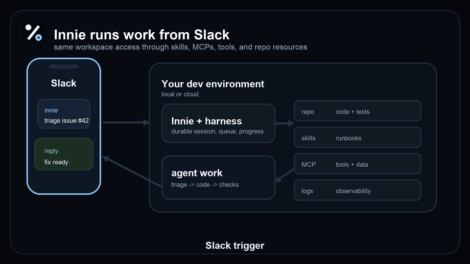

# Innie

[](https://github.com/darinyu/innie/actions/workflows/ci.yml)
[](LICENSE)
[](pyproject.toml)
[](https://pypi.org/project/innie/)


**Every worker deserves an innie: an AI work-self you can trigger from Slack anywhere, any time.**

> Innie is an early prototype. The repo contains local setup, guided Slack
> setup, durable state, hooks, session inspection, the local dashboard, and
> Codex and Claude Code adapter paths.



## What Is Innie?

Innie is the thinnest customizable layer between Slack and agent harnesses. The
current repo supports Codex CLI and Claude Code; custom runtimes are future
adapter targets. You run Innie in your own dev environment, local or cloud. It
keeps Slack-triggered work durable, visible, resumable where the harness supports
it, and observable while the selected harness does the actual agent work.

The human is the **Outie**: the person who asks from Slack, follows progress,
and receives the result.

The bet is simple: **harnesses keep getting better**. Innie should not replace
their planning, coding, permissions, tools, or model behavior. Innie owns the
operating envelope around them:

- **Slack in, Slack out**: trigger work from Slack and get replies back in the
  thread.
- **Harness adapter boundary**: keep Codex CLI, Claude Code, and future
  runtimes behind adapters.
- **Your environment, your access**: run the harness where your repos, CLIs,
  MCP servers, credentials, and local tools already work.
- **Durable by default**: persist sessions, queued follow-ups, progress events,
  harness resume ids, hooks, artifacts, and observability data.

Innie is *NOT* a new agent loop, policy engine, model runtime, or semantic memory
system. It is the minimum product shell that can make a harness feel like a
dependable worker.

## How It Works

```text
Slack
  user asks from phone or desktop
    |
Innie
  session state, queue, hooks, progress, dashboard, observability
    |
Harness adapter
  Codex CLI, Claude Code, echo, or future runtime
    |
Your dev environment
  repo, tests, skills, MCPs, tools, logs, artifacts
```

## Quickstart

The path is:

1. Download the repo.
2. Check and install dependencies with the provided script.
3. Set up the Slack bot with the guided setup wizard.
4. Start the fun.

### 1. Download The Repo

```bash
git clone https://github.com/darinyu/innie.git
cd innie
```

### 2. Check And Install Dependencies

Install the `innie` command from this checkout. The provided script checks local
dependencies and installs or refreshes the command. It is safe to rerun after
pulling updates:

```bash
python3 scripts/install.py
```

### 3. Set Up The Slack Bot

Create local state and start the guided Slack setup wizard:

```bash
innie init
```

It is safe to rerun `innie init`. Existing local state and Slack configuration
are kept; rerun `innie slack setup` when you intentionally want to update Slack
tokens or app settings.

To create local state without Slack setup:

```bash
innie init --skip-slack-setup
```

To run the Slack setup wizard later:

```bash
innie slack setup
```

For the guided Slack checklist, see
[`docs/slack-setup.md`](docs/slack-setup.md).

### 4. Start The Fun

Run a first Slack-routed smoke test, then keep Innie running when you are ready:

```bash
innie run --once --harness codex
innie run
```

## Run

Test the local route without Slack by feeding one Slack-shaped event file through
the diagnostic echo adapter:

```bash
innie run --once --event-file event.json --harness echo
```

After `innie slack setup`, test one real Slack-routed Codex event and exit:

```bash
innie run --once --harness codex
```

Claude Code is available as an opt-in peer harness:

```bash
innie run --once --harness claude
```

`--once` is a smoke-test mode: Innie connects, waits for one routed Slack event,
processes it, prints the session id and log command, then exits.

Run continuously with:

```bash
innie run
```

Stop it with Ctrl-C.

Use `--harness echo` when you want to debug Slack routing without starting
Codex or Claude.

## Development

Innie is a Python project built with Hatchling.

```bash
python3 -m pip install -e .
PYTHONPATH=src python3 -m unittest discover -s tests -v
```

Useful local commands:

```bash
innie init --skip-slack-setup
innie dash
```

`innie dash` starts a lightweight local web dashboard for the selected
workspace. It reads `.innie/innie.db` and `.innie/logs/innie.log` directly, so it
is read-only and can be run alongside `innie run`. The dashboard is intended for
local inspection of sessions, task events, hooks, artifacts, health, and logs.

Read [`docs/initial-plan.md`](docs/initial-plan.md) for the current product and
architecture plan.

## PyPI

Innie is published on PyPI as an alpha package:

```bash
pipx install innie
```

The release path builds clean wheel and source distributions, validates package
metadata, smoke-tests the installed wheel in CI, and publishes through PyPI
trusted publishing. See [`docs/pypi-release.md`](docs/pypi-release.md) for the
release checklist.

## Requirements

- Python 3.10+.
- SQLite 3 for local durable session state.
- Rich for colored, wrapped terminal setup screens. `scripts/install.py` asks
  before installing it, and Innie falls back to plain text if you skip it.
- A Slack app for DM and channel mention triggers.
- Codex CLI or Claude Code CLI. Codex remains the default; Claude is opt-in via
  `--harness claude`. OpenCode, Goose, and custom runtimes are future adapters.
- Optional MCP servers, skills, CLIs, and credentials from your own dev
  environment.

## Local State And Secrets

Innie stores local runtime state under `.innie/` in the selected workspace.
Slack tokens and generated Slack metadata are part of that setup flow.

Do not commit `.innie/` or Slack credentials. The prototype is designed for
local development first, so review generated files and permissions before using
it in a shared or remote environment.

## Roadmap

Near-term prototype milestones:

- Harden the Codex path into the first stable adapter contract.
- Improve Slack-triggered task progress and result delivery.
- Persist enough state to explain, retry, or resume interrupted work.
- Make lifecycle hooks stable enough for local customization.
- Improve observability events, status output, and failure diagnostics.
- Add scheduled runs after the Slack-triggered loop is stable.
- Add OpenCode, Goose, or custom adapters after the Codex and Claude paths prove
  the adapter contract.
- Add production-oriented docs after the local prototype proves the core loop.

## Contributing

This repo is still early, so small, focused PRs are the best way to contribute.

Good first areas:

- Tighten the Slack onboarding flow.
- Improve setup validation and error messages.
- Add focused tests for session, hook, runtime, and adapter behavior.
- Implement or refine a harness adapter.
- Improve observability events and status output.
- Refine docs, logo assets, and demo materials.

Design constraints:

- Keep Innie thin.
- Keep state durable.
- Keep Slack useful first.
- Keep harness behavior behind adapters.
- Prefer simple local defaults before distributed infrastructure.

Open-source hygiene still to add:

- `CODE_OF_CONDUCT.md` if the project wants an explicit community standard.
- GitHub issue templates once the contribution surface is clearer.

## License

Innie is licensed under the Apache License, Version 2.0. See [`LICENSE`](LICENSE)
for details.
